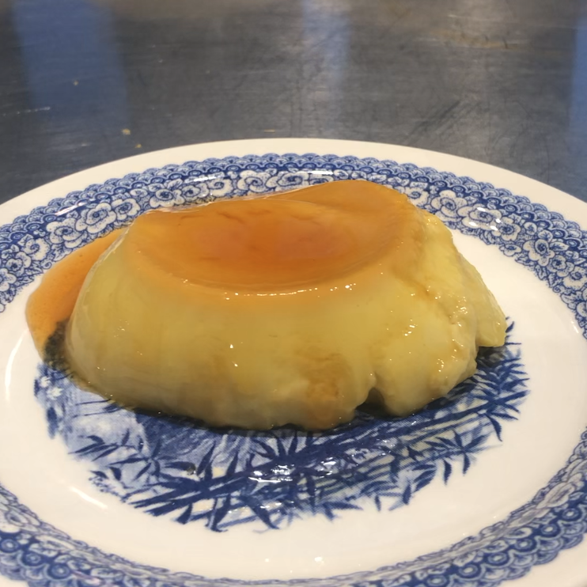

# Coconut Créme Caramel 🍮

Dairy free Créme Caramel made with coconut cream instead of milk or cream.

> Note, this recipe is a WIP.

  
  
<small>v2 - result of the second sprint! 🤣</small>

## Getting Started

First thing, preheat oven to 170C.

The recipe makes enough for about 4 ramekins, or 4 half-cups 🤷‍♂️.

## Caramel

- 1/4 cup sugar
- 2 tablespoons hot water

Add ingredients to a saucepan on medium-high heat, then let the sugar boil down. When the water has all evaporated, **DO NOT STIR THE SUGAR**, let it continue boiling down until it is a deep brown colour.

If you need to move the sugar/caramel/mixture around to heat it evenly, pick up and rotate the saucepan up over the heat source.

Once the sugar thickens and resembles a syrup, pour the caramel into ramekins.

## Flan

<!-- v3 recipe -->

- 2 cups coconut cream 
- 2 eggs
- 2 egg yolk
- 2 teaspoons vanilla extract 
- 1/4 cup sugar

Gently heat coconut cream in saucepan. Do not simmer or boil. Take off the heat as soon as the cream starts to steam.

In a separate bowl, mix the eggs, sugar, vanilla essence.

Once the cream is warm and steaming, add a tablespoon of warm cream to the egg/sugar mixture while stirring the egg mixture.

Keep adding warm cream to the egg mixture one tablespoon at a time while constantly stirring the egg mixture. This is to temper the eggs and prevent them from scrambling from the warm cream.

Once half the cream has been added to the egg mixture, it should be safe to add the rest of the cream to the egg mixture and stir all of it together.

Now pour the mixture into the same ramekins that have the caramel. The caramel should be hard at this point.

Put the ramekins in a bain-marie and place in a pre-heated oven at 170C for 30 mins.

Once the 30mins is up, take the ramekins out and let them cool down enough to pick them up with your bare hands. Put the ramekins in the fridge to properly cool down and set.
